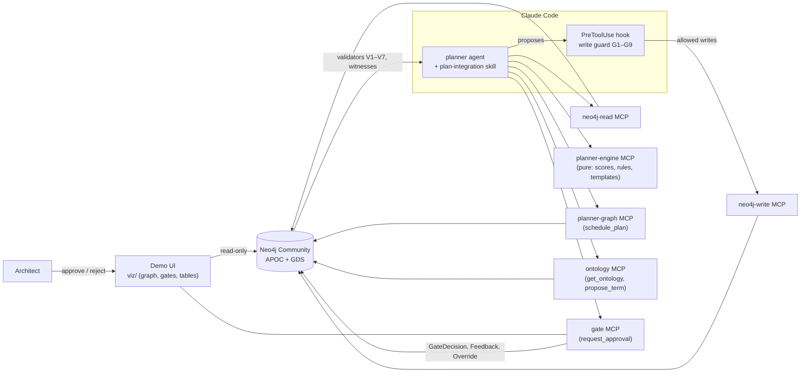

# neurosymbolic-planner-neo4j

An integration-planning agent where **the LLM proposes and the graph decides**. It is built on Neo4j and the official Neo4j MCP server, and is the companion repo for a NODES 2026 talk.

The agent reads an acquired company's findings, frames use cases, and picks integration patterns from a catalog. Everything that must be right comes from the graph, not the model:
- the fit scores, task lists and schedule;
- the conflicts and missing prerequisites;
- whether a write is allowed at all.

A human architect approves each step at a gate. All companies, deals, people and data in this repo are fictional (Harborline acquiring Nimbus Ledger; Tidewater and Quarry as history).

| | |
|---|---|
| **Tier 0** | Replay a recorded run into the demo UI. No LLM and no account; under 5 minutes from a fresh clone. |
| **Tier 1** | Run the live planner agent in Claude Code against your local graph. |
| **Tier 2** | Make it yours: reject a gate, propose a term, explore in Neo4j Browser, record your own run. |

Requirements: **Docker** (Docker Desktop or Rancher Desktop), **Node 24** (`.nvmrc`), macOS or Linux.

## Tier 0: replay, no LLM

```bash
git clone <this repo> && cd neurosymbolic-planner-neo4j
npm run quickstart        # checks prerequisites, npm ci, Neo4j MCP, Neo4j + APOC + GDS, demo data, UI build
```

Then, in two terminals:

```bash
npm run demo:ui                          # open http://127.0.0.1:4646/?deal=nimbus
npm run demo:replay -- --delay 800       # replays the golden Nimbus run into the page
```

The page shows three scenes (`1` Knowledge, `2` Plan, `3` Decisions), the gate panel, and the tables (`4`: buy vs build, resource load, validators, iteration diff). During the replay you'll see:
- the plan grow;
- validator witnesses turn red: P1, a missing prerequisite, and P2, two selected patterns that conflict;
- the repairs land;
- the gates get decided;
- the roadmap get committed.

`npm run demo:replay -- data/replays/nimbus-p4.jsonl` replays the feedback story: a rejection, then iteration 2, then the diff that explains it.

**How replay works.** A recording (`data/replays/*.jsonl`) holds three things:
- the run's state-changing MCP calls: writes, gates, feedback, scheduling;
- the architect's decisions;
- the graph counts and validator verdicts the run ended with.

Replay wipes and reloads the graph, then re-sends every call to the same MCP servers. Each write goes through the write guard first, and the recorded decisions are made while the gate tools wait. It exits 1 if the final counts or verdicts differ. `tests/replay/golden.test.ts` runs the same check in CI.

`scripts/fresh-clone-check.sh` times a fresh copy of the repo to Tier 0 in isolation, with a cold npm cache, a fresh Neo4j container and plugins, other ports, and your database untouched.

## Tier 1: the live agent (Claude Code)

After Tier 0's quickstart:

```bash
claude plugin marketplace add ./          # this repo is its own marketplace (the ./ is required)
claude plugin install planner@nodes26
npm run demo:ui                           # keep it open: this is where you approve gates
claude --agent planner:planner            # from the repo root
```

Ask it: *"Plan the Nimbus integration."* Approve or reject each gate in the page. Here's what keeps the model honest:
- `.mcp.json` declares the servers. Claude Code asks you to approve them the first time; `/mcp` shows their status.
- The write guard runs as a PreToolUse hook on every `write-cypher` call (`.claude/settings.json`). Its decisions are logged to `.logs/guard.jsonl`.
- `npm run check:tools` checks that the skill, the agent's tool allowlist, and the served tools agree.

| Server | What it is |
|---|---|
| `neo4j-read` | Official Neo4j MCP server, read-only: `get-schema`, `read-cypher` |
| `neo4j-write` | Official Neo4j MCP server with `write-cypher`, behind the write guard |
| `planner-engine` | Pure planning functions: fit scoring, classification, buy vs build, provenance, Cypher templates |
| `planner-graph` | Server-side scheduling (`schedule_plan`: cycle check, then GDS longest path) |
| `gate` | `request_approval` / `await_approval` / `resolve_feedback`; it also serves the demo UI |
| `ontology` | `get_ontology`, `propose_term` |

They connect with `NEO4J_URI`, `NEO4J_USERNAME`, and `NEO4J_PASSWORD`, which default to the Docker setup (see `.env.example`).

**Optional: an Anthropic-compatible gateway (experimental).** Claude Code can reach Claude through any gateway that speaks the Anthropic Messages API: set `ANTHROPIC_BASE_URL` (and `ANTHROPIC_AUTH_TOKEN` if the gateway needs it) before `claude`. This is experimental. It is not tested in CI, and the agent's behavior depends on the model the gateway serves. The guard, gates, and validators still hold, because they don't trust the model.

## Tier 2: make it yours

- **Push back.** At the select gate, reject with a comment such as `remove cdc-replication` (P4). The agent starts iteration 2 from its memory. The Decisions scene and the `iteration diff` table then show what changed and which feedback drove it.
- **Ask for a concept the model lacks** (P3), for example data residency. The guard denies the invented label, the agent calls `propose_term`, and you approve the term at an ontology gate. The term then exists for this deal only.
- **Explore in Neo4j Browser** at http://localhost:7474 (user `neo4j`, password `planner-demo`):
  - drag `browser/style.grass` onto Browser for the demo palette;
  - import `browser/favorites.cypher` (the scenes, validators, BB1, iteration diff), after `:param deal => "nimbus"` and `:param iteration => 1`;
  - turn **off** "Connect result nodes", and zoom to 125–150%.
- **Record your run.** Right after a session ends, and before anything resets the graph:
  ```bash
  npm run record:session -- --transcript ~/.claude/projects/<project>/<session>.jsonl --out data/replays/my-run.jsonl
  npm run demo:replay -- data/replays/my-run.jsonl
  ```
  Only MCP tool arguments and results are kept, never prompts or chat.
- **Reset** with `./scripts/reset-demo.sh`. It wipes the per-deal subgraphs, then loads; `npm run load` alone refuses a graph a run has changed.

## Architecture



- **The graph is the contract.** `config/ontology.json` lists the allowed labels, relationships, and keys. The guard denies anything else and the reserved labels, and every write is parameterized, bounded, and scoped to the deal.
- **The model proposes; the graph decides.** Candidates, fit scores, tasks, and dependencies come from the catalog and the engine. Validators (`graph/queries/validators/`) return one row each, with witnesses. The agent repairs from those witnesses: near-misses for conflicts, derived prerequisites for gaps.
- **Humans decide at gates.** A gate blocks the agent until the architect decides in the page. Rejections become Feedback and Override nodes, and the next iteration re-plans from them.
- The design contract is [`docs/design/DESIGN.md`](docs/design/DESIGN.md). The fictional data and the planted situations P1–P6 are in [`docs/design/DATA.md`](docs/design/DATA.md).

## Optional: the agent on the AI SDK

`examples/ai-sdk/` runs the same planner without Claude Code, in about 140 lines:
- an AI SDK `ToolLoopAgent`, with the model from env;
- instructions from the plugin's agent file and `SKILL.md`;
- MCP clients for every `.mcp.json` server, filtered to the planner's tool allowlist;
- `write-cypher` wrapped with `guard.validate`, so a denial goes back to the model as the hook does.

The gate server is unchanged, so you approve in the demo UI.

```bash
npm run demo:ui                                                         # one terminal
ANTHROPIC_API_KEY=… npm run example:ai-sdk -- "Plan the Nimbus integration."   # another
```

`PLANNER_MODEL` picks the model: `anthropic:<model id>` (default `anthropic:claude-sonnet-5-5`; `ANTHROPIC_BASE_URL` is honored), or `openai-compatible:<model id>` with `OPENAI_COMPATIBLE_BASE_URL` and `OPENAI_COMPATIBLE_API_KEY`. `tests/examples/ai-sdk.test.ts` checks the allowlist, the guard wrapper, and the step cap with a mock model, without an LLM.

Check a run against the planted situations (`docs/design/DATA.md`). For P3 and P4 you act at the gates: approve the proposed term, and reject a selection with a comment.

| | Expected |
|---|---|
| P1 | V1 fails, and the missing federation pattern is derived and added |
| P2 | V2 witness, then the stored near-miss is selected |
| P3 | Guard G6 denies the residency label; `propose_term` → approve → the write succeeds |
| P4 | Feedback and Override are written; iteration 2 runs; `iteration diff` explains the change |
| P5 | V3 witness on the cyclic variant; scheduling refuses to run |
| P6 | SSO → integrate; audit logging → retire; billing ledger → review |

**Recorded runs**

| Model | Result | Date |
|---|---|---|
| Claude (`anthropic:claude-sonnet-5-5`) | not run yet | |
| Non-Claude, **experimental** (`openai-compatible:…`) | not run yet | |

**Experimental.** Non-Claude models are not tested in CI. The skill was written and tuned for Claude, and results vary by model. The guard, gates, and validators hold regardless, because they don't trust the model.

## Gotchas

Nine things that went wrong while building this, each reproducible. A test shows the failure with the naive version, then that the fix in this repo catches it. They run with `npm test`.

| # | Gotcha | The fix |
|---|---|---|
| 01 | [The schema is not a contract](gotchas/01-schema-is-not-a-contract/) | `get_ontology`; guard G6 |
| 02 | [Prompt rules are not guardrails](gotchas/02-prompt-rules-are-not-guardrails/) | Guard G2, G4, G5 |
| 03 | [Tool allowlist drift](gotchas/03-tool-allowlist-drift/) | `npm run check:tools` in CI |
| 04 | [The graph as an index](gotchas/04-graph-as-index/) | Selection and Candidate nodes |
| 05 | [Dynamic label sprawl](gotchas/05-dynamic-label-sprawl/) | `propose_term` and an ontology gate |
| 06 | [Feedback lost in chat](gotchas/06-feedback-lost-in-chat/) | Iteration, Feedback, `iteration_diff` |
| 07 | [Validators that fail open](gotchas/07-validators-that-fail-open/) | `examined` counts; exact provenance |
| 08 | [Cycles and GDS direction](gotchas/08-cycles-and-gds-direction/) | Cycle check first; flipped projection |
| 09 | [The engine ahead of the data](gotchas/09-engine-ahead-of-data/) | V7 edge coverage in CI |

## Repo map

| Path | What |
|---|---|
| `packages/engine` | Pure planning logic (no I/O): fit, classification, strategy, scheduling, buy vs build, templates |
| `packages/guard` | The write guard (G1–G9) and its Claude Code hook |
| `packages/gate` | Gate MCP server, gate store, and the demo UI's HTTP API |
| `packages/*-mcp` | The engine, graph (scheduling), and ontology MCP servers |
| `graph/` | Schema, loaders, validators, skill queries, replay |
| `plugin/` | The Claude Code plugin: `planner` agent and `plan-integration` skill |
| `viz/` | The demo UI (Vite and Cytoscape.js) |
| `data/` | The fictional catalog, deal, history, and replay recordings |
| `gotchas/` | The nine reproducible gotchas |

## Commands

| Command | What it does |
|---|---|
| `npm run quickstart` | Fresh clone → Tier 0 |
| `npm run demo:ui` | Builds the page if needed, then serves it with the gate API (port `GATE_PORT`, default 4646) |
| `npm run demo:replay` | Tier 0 replay (`-- <file> --delay <ms>`) |
| `npm test` | Unit, graph, e2e, gotcha, and golden tests (needs Neo4j up; reloads the database) |
| `npm run rehearse` | Release check: 5 timed runs of reset → tests → UI tests → replay, on an isolated Neo4j (`reports/rehearsal.json`) |
| `npm run test:ui` | Playwright tests of the page (first run: `npx playwright install chromium`) |
| `npm run load` | Applies the schema, then loads the catalog, deals, and history |
| `npm run generate` | Regenerates the seeded demo data |
| `npm run check:tools` | Skill = agent tools ⊆ served tools, write tools guarded |
| `npm run coverage:edges` | V7 knowledge-edge coverage report |
| `npm run record:session` | Turns a Claude Code transcript into a replay recording |
| `npm run example:ai-sdk` | The planner on the AI SDK (optional; needs a model API key) |
| `npm run record:golden` | Re-records the committed replays from the scripted walks |

## Troubleshooting

- **Docker is not running.** Start Docker Desktop or Rancher Desktop. For Rancher, check that `~/.rd/docker.sock` exists.
- **Port 7474, 7687, or 4646 is taken.** Set `NEO4J_HTTP_PORT` and `NEO4J_BOLT_PORT` for compose, with a matching `NEO4J_URI`, and `GATE_PORT` for the page.
- **`neo4j-mcp is not installed`.** Run `npm run mcp:neo4j:install`, which installs the pinned binary after checking its checksum.
- **Neo4j reports a critical error, or `OutOfMemoryError`, after many test runs.** Run `docker compose restart neo4j`. If it recurs, raise `NEO4J_server_memory_heap_max__size` in `docker-compose.yml`.

## License

MIT, see [`LICENSE`](LICENSE).
